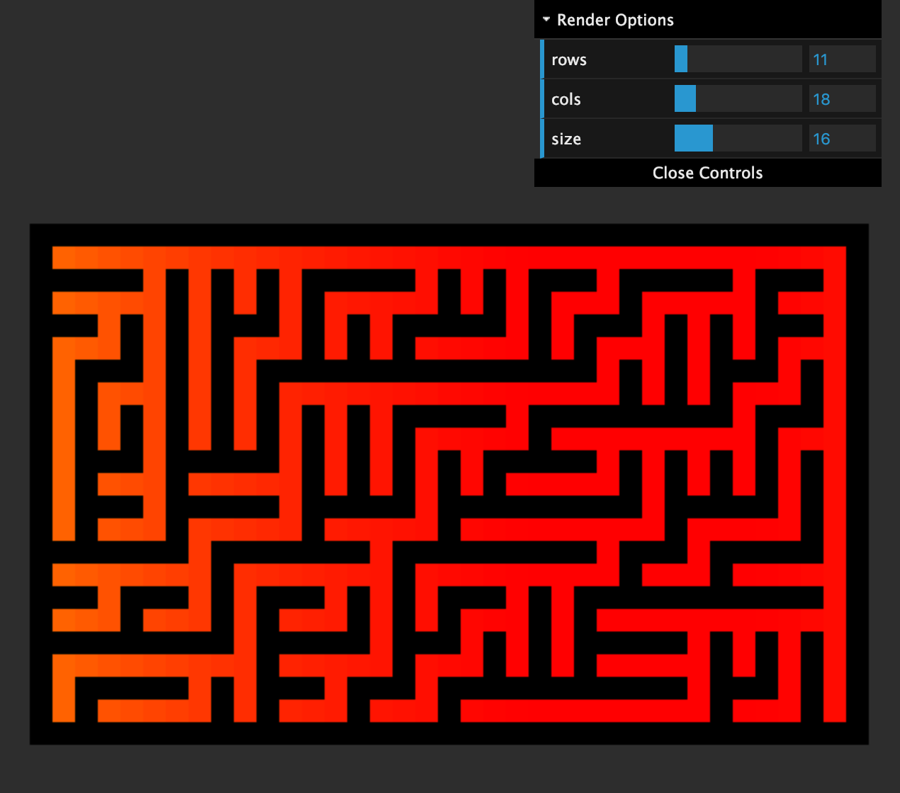

 

# Maze generation algorithms

- [Binary Tree Maze Generation](https://binarytreemaze.surge.sh)

## Change Log

- Binary Tree Exmaple
- Initial Commit - template.

## Run the example

Requires Node v10.15.3 or greater

```bash
$ yarn install
$ yarn run dev & open http://localhost:2020
```

## License

[MIT]
